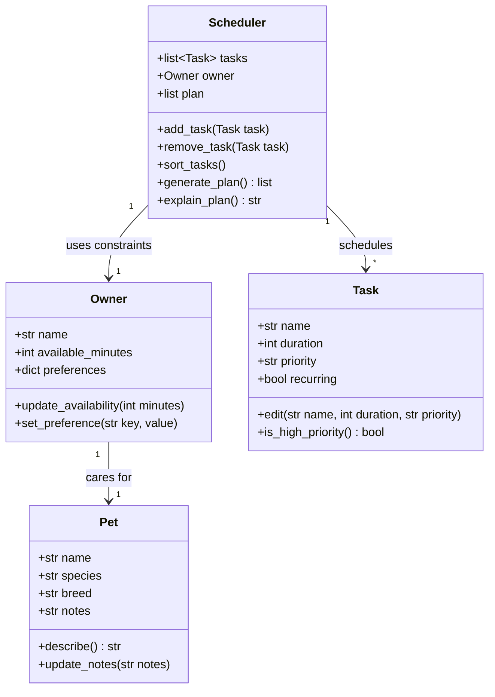

# PawPal+ Project Reflection

## 1. System Design

### Core User Actions

Based on the project scenario, a user of PawPal+ should be able to do three core things:

1. **Set up their owner and pet profile.** The user enters basic information about themselves (such as their name and how much time they have available each day) and about their pet (name, species/breed, and any care preferences). This profile gives the app the context it needs to tailor a plan.

2. **Manage care tasks.** The user can add, edit, and remove pet care tasks — walks, feeding, medications, enrichment, grooming, and so on. For each task they specify at least a duration (how long it takes) and a priority (how important it is), so the scheduler knows what to fit in and in what order.

3. **Generate and view a daily plan.** The user asks PawPal+ to produce a daily schedule from their tasks, the available time, and their priorities/preferences. The app displays the plan clearly (which task happens when) and explains the reasoning behind the choices it made.

### Building Blocks (Main Objects)

The system is organized around four main objects. For each, the information it holds (attributes) and the actions it performs (methods) are listed below.

#### `Owner`
- **Responsibility:** Represents the pet owner and their daily constraints.
- **Attributes:**
  - `name`: the owner's name.
  - `available_minutes`: total time the owner has available per day.
  - `preferences`: owner preferences (e.g., preferred times, task types to favor).
- **Methods:**
  - `update_availability(minutes)`: change the daily time budget.
  - `set_preference(key, value)`: record an owner preference.

#### `Pet`
- **Responsibility:** Represents the pet being cared for.
- **Attributes:**
  - `name`: the pet's name.
  - `species`: e.g., dog, cat.
  - `breed`: e.g., Golden Retriever.
  - `notes`: any special care notes.
- **Methods:**
  - `describe()`: return a short description of the pet.
  - `update_notes(notes)`: update care notes.

#### `Task`
- **Responsibility:** Represents a single care task to be scheduled.
- **Attributes:**
  - `name`: what the task is (e.g., "Morning walk").
  - `duration`: how many minutes the task takes.
  - `priority`: importance level (e.g., high/medium/low).
  - `recurring`: whether the task repeats (e.g., daily).
- **Methods:**
  - `edit(name, duration, priority)`: modify the task's details.
  - `is_high_priority()`: return whether the task is high priority.

#### `Scheduler`
- **Responsibility:** Builds the daily plan from tasks and constraints, and explains it.
- **Attributes:**
  - `tasks`: the list of `Task` objects to consider.
  - `owner`: the `Owner` whose constraints apply.
  - `plan`: the resulting ordered list of scheduled tasks.
- **Methods:**
  - `add_task(task)`: add a task to the pool.
  - `remove_task(task)`: remove a task from the pool.
  - `sort_tasks()`: order tasks by priority (and duration as a tiebreaker).
  - `generate_plan()`: fit tasks into available time and produce the daily plan.
  - `explain_plan()`: return a human-readable explanation of why the plan was chosen.

### UML Class Diagram

---

**a. Initial design**

My initial UML design centered on four classes, each with a single clear responsibility:

- **`Owner`** holds the person's daily constraints — their `name`, how many `available_minutes` they have per day, and a `preferences` dictionary. Its job is to represent the human context the scheduler has to work within.
- **`Pet`** is a plain data object describing the animal being cared for (`name`, `species`, `breed`, `notes`), with light behavior like `describe()` and `update_notes()`.
- **`Task`** represents one unit of care work (`name`, `duration`, `priority`, `recurring`). It knows how to `edit()` itself and answer `is_high_priority()`.
- **`Scheduler`** is the brain: it owns the `tasks` list and a reference to the `owner`, and it produces a `plan`. It carries the real logic — `add_task`/`remove_task`, `sort_tasks`, `generate_plan`, and `explain_plan`.

The relationships were: an `Owner` cares for a `Pet`, and a `Scheduler` uses one `Owner`'s constraints to schedule many `Task`s. I deliberately kept data (`Pet`, `Task`) separate from behavior (`Scheduler`) so the scheduling logic lives in one place instead of being scattered across the data objects.

**b. Design changes**

Yes — one change came out of implementing the skeleton. I originally imagined `Pet` and `Task` as regular classes with hand-written `__init__` methods, the same way I wrote `Owner` and `Scheduler`. When I translated the UML into Python I made `Pet` and `Task` **dataclasses** instead. They are pure data containers with no real construction logic, so the dataclass decorator removes the boilerplate `__init__`, gives me sensible defaults (`breed=""`, `recurring=False`), and keeps the files clean and readable. I left `Owner` and `Scheduler` as regular classes because they hold mutable collections and coordinate behavior, so an explicit `__init__` (guarding against a shared mutable default for `preferences`/`tasks`) is clearer there. The class names, attributes, and relationships from the original UML stayed the same.

---

## 2. Scheduling Logic and Tradeoffs

**a. Constraints and priorities**

- What constraints does your scheduler consider (for example: time, priority, preferences)?
- How did you decide which constraints mattered most?

**b. Tradeoffs**

- Describe one tradeoff your scheduler makes.
- Why is that tradeoff reasonable for this scenario?

---

## 3. AI Collaboration

**a. How you used AI**

- How did you use AI tools during this project (for example: design brainstorming, debugging, refactoring)?
- What kinds of prompts or questions were most helpful?

**b. Judgment and verification**

- Describe one moment where you did not accept an AI suggestion as-is.
- How did you evaluate or verify what the AI suggested?

---

## 4. Testing and Verification

**a. What you tested**

- What behaviors did you test?
- Why were these tests important?

**b. Confidence**

- How confident are you that your scheduler works correctly?
- What edge cases would you test next if you had more time?

---

## 5. Reflection

**a. What went well**

- What part of this project are you most satisfied with?

**b. What you would improve**

- If you had another iteration, what would you improve or redesign?

**c. Key takeaway**

- What is one important thing you learned about designing systems or working with AI on this project?
