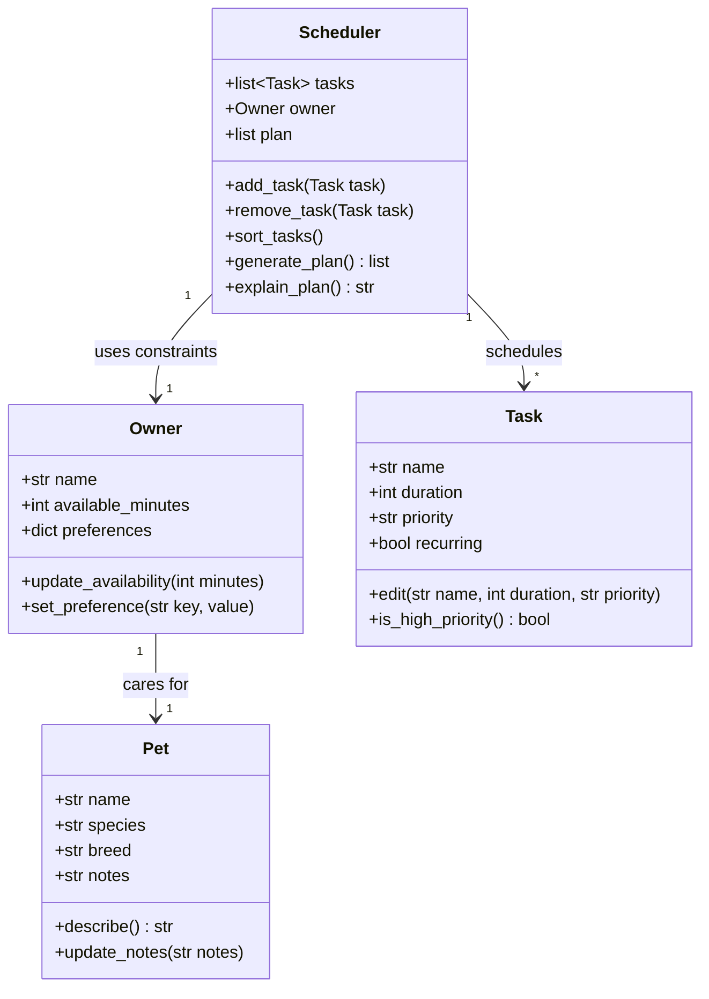

# PawPal+ Project Reflection

## 1. System Design

### Core User Actions

Based on the project scenario, a user of PawPal+ should be able to do three core things:

1. **Set up their owner and pet profile.** The user enters basic information about themselves (such as their name and how much time they have available each day) and about their pet (name, species/breed, and any care preferences). This profile gives the app the context it needs to tailor a plan.

2. **Manage care tasks.** The user can add, edit, and remove pet care tasks — walks, feeding, medications, enrichment, grooming, and so on. For each task they specify at least a duration (how long it takes) and a priority (how important it is), so the scheduler knows what to fit in and in what order.

3. **Generate and view a daily plan.** The user asks PawPal+ to produce a daily schedule from their tasks, the available time, and their priorities/preferences. The app displays the plan clearly (which task happens when) and explains the reasoning behind the choices it made.

### Building Blocks (Main Objects)

The system is organized around four main objects. For each, the information it holds (attributes) and the actions it performs (methods) are listed below.

#### `Owner`
- **Responsibility:** Represents the pet owner and their daily constraints.
- **Attributes:**
  - `name`: the owner's name.
  - `available_minutes`: total time the owner has available per day.
  - `preferences`: owner preferences (e.g., preferred times, task types to favor).
- **Methods:**
  - `update_availability(minutes)`: change the daily time budget.
  - `set_preference(key, value)`: record an owner preference.

#### `Pet`
- **Responsibility:** Represents the pet being cared for.
- **Attributes:**
  - `name`: the pet's name.
  - `species`: e.g., dog, cat.
  - `breed`: e.g., Golden Retriever.
  - `notes`: any special care notes.
- **Methods:**
  - `describe()`: return a short description of the pet.
  - `update_notes(notes)`: update care notes.

#### `Task`
- **Responsibility:** Represents a single care task to be scheduled.
- **Attributes:**
  - `name`: what the task is (e.g., "Morning walk").
  - `duration`: how many minutes the task takes.
  - `priority`: importance level (e.g., high/medium/low).
  - `recurring`: whether the task repeats (e.g., daily).
- **Methods:**
  - `edit(name, duration, priority)`: modify the task's details.
  - `is_high_priority()`: return whether the task is high priority.

#### `Scheduler`
- **Responsibility:** Builds the daily plan from tasks and constraints, and explains it.
- **Attributes:**
  - `tasks`: the list of `Task` objects to consider.
  - `owner`: the `Owner` whose constraints apply.
  - `plan`: the resulting ordered list of scheduled tasks.
- **Methods:**
  - `add_task(task)`: add a task to the pool.
  - `remove_task(task)`: remove a task from the pool.
  - `sort_tasks()`: order tasks by priority (and duration as a tiebreaker).
  - `generate_plan()`: fit tasks into available time and produce the daily plan.
  - `explain_plan()`: return a human-readable explanation of why the plan was chosen.

### UML Class Diagram

---

**a. Initial design**

My initial UML design centered on four classes, each with a single clear responsibility:

- **`Owner`** holds the person's daily constraints — their `name`, how many `available_minutes` they have per day, and a `preferences` dictionary. Its job is to represent the human context the scheduler has to work within.
- **`Pet`** is a plain data object describing the animal being cared for (`name`, `species`, `breed`, `notes`), with light behavior like `describe()` and `update_notes()`.
- **`Task`** represents one unit of care work (`name`, `duration`, `priority`, `recurring`). It knows how to `edit()` itself and answer `is_high_priority()`.
- **`Scheduler`** is the brain: it owns the `tasks` list and a reference to the `owner`, and it produces a `plan`. It carries the real logic — `add_task`/`remove_task`, `sort_tasks`, `generate_plan`, and `explain_plan`.

The relationships were: an `Owner` cares for a `Pet`, and a `Scheduler` uses one `Owner`'s constraints to schedule many `Task`s. I deliberately kept data (`Pet`, `Task`) separate from behavior (`Scheduler`) so the scheduling logic lives in one place instead of being scattered across the data objects.

**b. Design changes**

one change came out of implementing the skeleton. I originally imagined `Pet` and `Task` as regular classes with hand-written `__init__` methods, the same way I wrote `Owner` and `Scheduler`. When I translated the UML into Python I made `Pet` and `Task` dataclasses instead. They are pure data containers with no real construction logic, so the dataclass decorator removes the boilerplate `__init__`, gives me sensible defaults (`breed=""`, `recurring=False`), and keeps the files clean and readable. I left `Owner` and `Scheduler` as regular classes because they hold mutable collections and coordinate behavior, so an explicit `__init__` (guarding against a shared mutable default for `preferences`/`tasks`) is clearer there. The class names, attributes, and relationships from the original UML stayed the same.

---

## 2. Scheduling Logic and Tradeoffs

**a. Constraints and priorities**

- What constraints does your scheduler consider (for example: time, priority, preferences)?
- How did you decide which constraints mattered most?

**b. Tradeoffs**

One deliberate tradeoff is in conflict detection: `find_conflicts()` only flags tasks that start at *exactly* the same date and time, rather than checking whether tasks *overlap* in duration. For example, a 30-minute walk at 08:00 and a feeding at 08:15 do overlap in reality, but my scheduler won't flag them — it only catches two tasks both due at 08:00.

I chose exact-match because it keeps the algorithm simple and easy to verify: group tasks by their (date, time) slot and warn when a slot has more than one task. Full overlap detection would need to convert every "HH:MM" string into minutes, compute each task's end time, and compare every pair of intervals — noticeably more code and more places for bugs, all to catch a case that matters less in this scenario. Pet care tasks are short and flexible (a feeding can slide 15 minutes without harm), and the warning is advisory — it doesn't block anything — so the cost of a missed overlap is low, while the cost of a confusing false alarm ("these don't start at the same time, why is it complaining?") felt higher. For a scheduler managing rigid appointments (a vet clinic, say), I'd make the opposite call and implement true interval-overlap checking.

---

## 3. AI Collaboration

**a. How you used AI**

I used Claude, inside VS Code, throughout the project, and my role was to direct it, review its work, and make the decisions rather than to accept whatever it produced. I identified the core user actions from the scenario, brainstormed the four classes with their attributes and methods, and then used the AI to translate that plan into a Mermaid UML diagram and Python skeletons. During implementation, I worked phase by phase for each one I decided what to build in each step, described the exact behavior I wanted, and then read through the generated code and its output before moving on. I ran the demo and the tests myself, and kept each commit scoped to one logical change so the history stayed readable.

A lot of my involvement was quality control and product judgment rather than typing code. I caught leftover starter text that would have shipped to users, rejected output formatting that was technically correct but useless in practice, spotted a demo that completed the wrong task, and questioned design choices (like collapsing the help sections) until the AI justified them well enough for me to agree. The prompting lesson I took away is that specific, behavior-level requests beat vague ones: "make the output better" gets generic polish, while "show skipped tasks with the same detail as scheduled ones, plus how many minutes short I am" got exactly what I had in mind. Asking the AI to explain why it chose something was often more valuable than the code itself, because it either taught me the reasoning or exposed that there wasn't any. My rule by the end was simple: the AI writes fast, but I read everything, run everything, and decide what stays.

**b. Judgment and verification**

One moment where I didn't accept the AI's output as-is was the demo script's handling of skipped tasks. The first version the AI wrote only printed something like `Skipped: Fetch practice (Mochi) — not enough time left`. That technically worked, but as a user it wasn't actually useful: it didn't tell me how long the task was, how important it was, or when it was supposed to happen — so I had no way to judge whether skipping it was reasonable or what I could do about it.

I asked the AI to redo that part so a skipped task shows the same detail as a scheduled one (due time, duration, priority) plus how many more minutes I would need to fit it in. Now the output says the schedule had "only 5 min left in the day" and that Fetch practice "needs 20 more min," which turns a vague message into something actionable.

To verify the change, I reran `python main.py` and checked the math by hand: the owner had 90 minutes, the plan used 85, so 5 minutes were left, and a 25-minute task really is 20 minutes short. The lesson for me was that AI-generated code can be *correct* but still not *good* — it satisfied the requirement to print a schedule, but I had to apply my own judgment about what information a real user would actually need.

A second thing I caught was in the Streamlit app after we wired it to the logic layer. The top of the page still showed the starter project's assignment text — the "Scenario" and "What you need to build" boxes, which literally told the reader "You will design and implement the scheduling logic." That text was written for me as the student, not for someone using the app, so a finished product showing its own homework instructions felt unpolished. I had the AI replace those boxes with real user-facing help: a "How to use" walkthrough of the app's sections and a "How scheduling works" explanation of the scheduler's rules. When the AI set both boxes to start collapsed, I asked it to justify that choice before accepting it — the reasoning (help text is read once, but the controls are used every visit, so the controls should stay front and center) made sense, so I kept it. I verified the change by reloading the app and confirming both sections render and expand correctly.

Verification also caught two real bugs in AI-generated code during the algorithms phase. First, the demo script was supposed to complete "Morning walk," but the printed output showed it completed "Feeding" instead the code had picked the task by its position in a list rather than by name, and the list wasn't in the order it assumed. Second, the first version of the conflict checker flagged tomorrow's auto-created walk as conflicting with today's medication: it compared clock times but ignored dates entirely. Both programs ran without any errors, the output was just wrong, and I only noticed because I read it line by line instead of trusting a clean run. Both fixes are now locked in by pytest tests (tasks are looked up by name, and same-time-on-different-days is explicitly tested as *not* a conflict), so neither bug can quietly come back.

---

## 4. Testing and Verification

**a. What you tested**

The suite has 13 tests in two layers. The first layer verifies the core behaviors directly: marking a task complete actually changes its status, adding a task grows the right pet's list, sorting returns tasks in chronological order (untimed tasks last), filtering by pet returns only that pet's tasks, completing a daily task auto-creates the next day's copy (and a one-time task doesn't), and conflict detection flags two tasks at the same time while ignoring the same time on different days. The second layer is edge cases: an owner with no pets, a pet with no tasks, a task longer than the entire time budget, and a tight-budget scenario where only one of two tasks can fit, verifying that priority wins over order of entry.

These tests mattered for two different reasons. The behavior tests exist because two of those behaviors had already been wrong once (the demo completed the wrong task, and the conflict checker ignored dates), so the tests are there to make sure those exact bugs can't return unnoticed. The edge cases exist because they're what a real user hits on day one, like a brand-new user with no pets clicking "Generate schedule," and because empty lists are where this kind of code typically breaks. Every test failure would point at real, user-visible misbehavior instead of an implementation detail.

**b. Confidence**

I'd put my confidence at 4 out of 5. Every algorithmic feature has at least one test locking in its behavior, the empty and boundary cases pass, and the whole suite plus the CLI demo run green after every change. So for valid inputs, I'm confident the scheduler does what it claims.

The missing star is for the gaps I know about. Conflict detection only catches exact same-time starts, so an overlapping pair (a 30-minute walk at 08:00 and a feeding at 08:15) passes silently. That's a documented tradeoff, but it's still untested territory. Time and date values are trusted to be well-formed ("HH:MM", ISO dates) because the UI constrains them, so malformed strings from any other source are unhandled. And the recurring-task math trusts `timedelta` across month boundaries, but I never explicitly tested completing a daily task on the last day of a month. With more time, those are the next three tests I'd write: interval-overlap detection, malformed input rejection, and month-boundary recurrence.

---

## 5. Reflection

**a. What went well**

- What part of this project are you most satisfied with?

**b. What you would improve**

- If you had another iteration, what would you improve or redesign?

**c. Key takeaway**

- What is one important thing you learned about designing systems or working with AI on this project?
